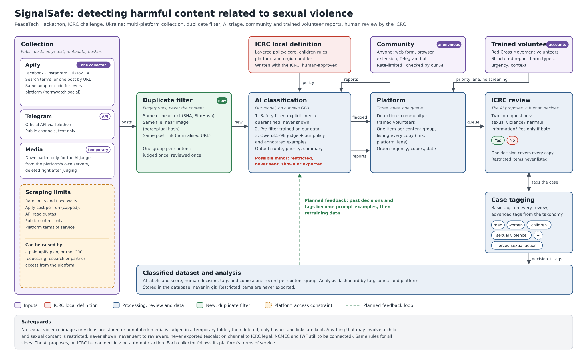
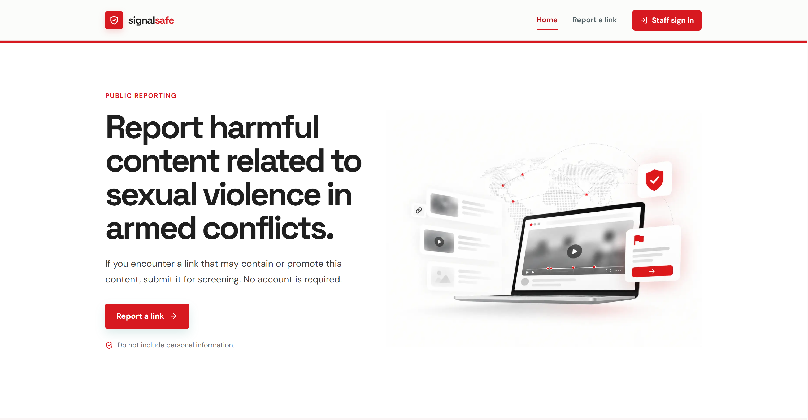
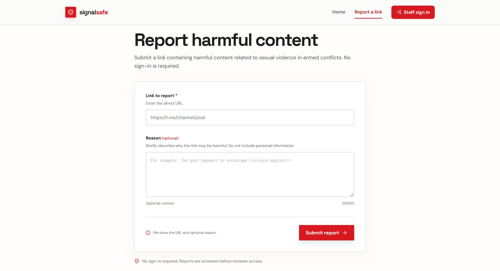
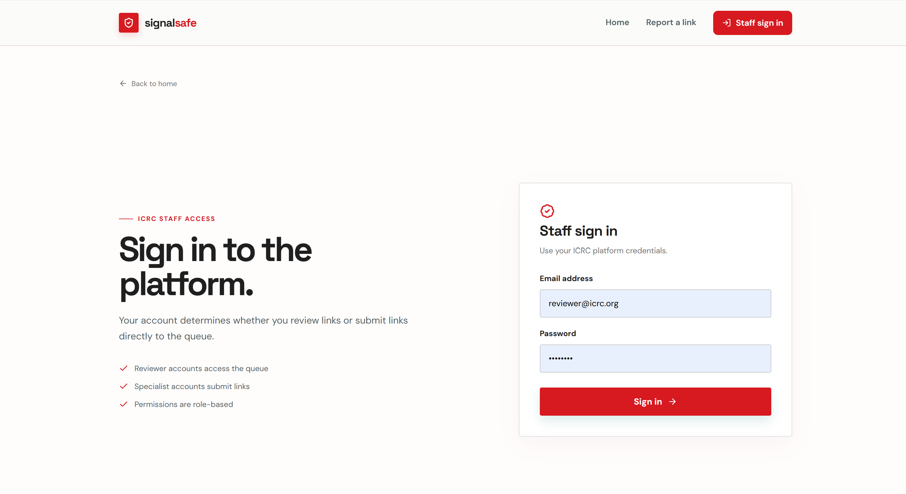
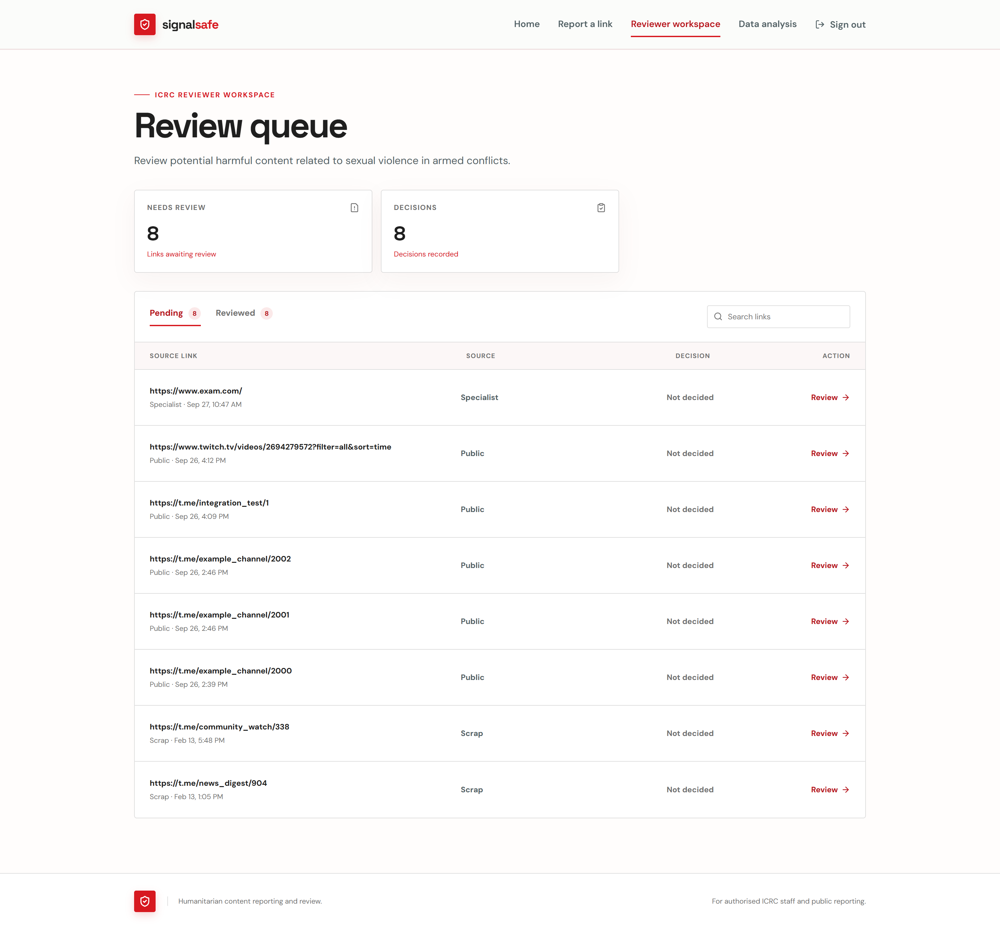
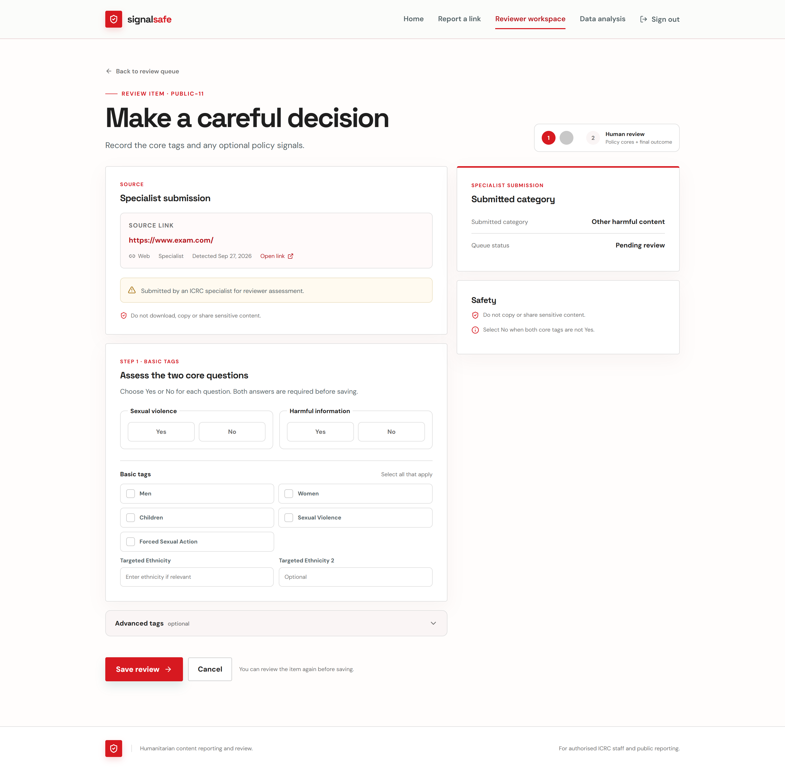
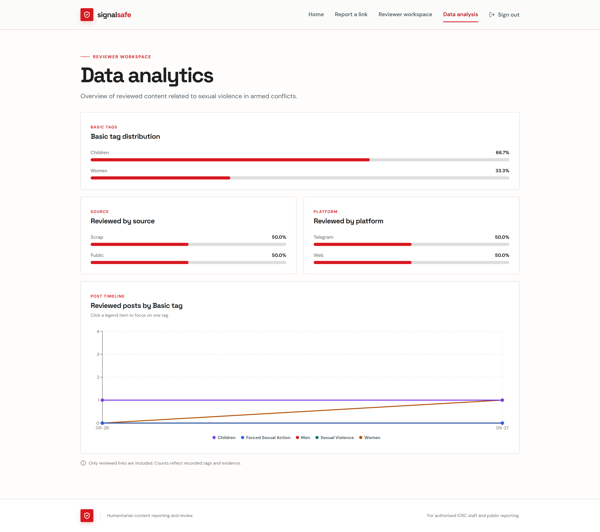
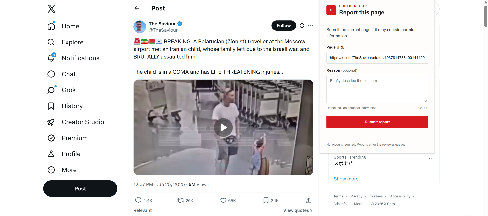

# SignalSafe

**PeaceTech Hackathon, ICRC challenge:** how can we identify harmful content related to sexual violence?

SignalSafe collects links to harmful content related to sexual violence in armed conflicts from social media and from the people who see it, filters out duplicates, has our own AI model triage it, and gives ICRC reviewers a safe place to decide and tag each case. `harmwatch` is the name of its detection package.



## Team

- Carlos Rafael Gonzalez Soffnee
- Davide Hoxhaj
- Gayet Nino
- Ghita Mikou
- Ismael MARKRIA
- Julius Schmitz
- Théo Goyette
- Xiru Wang

## How it works

Content reaches ICRC reviewers through three lanes. Every copy of the same content (a repost, the same image on another platform, the same link reported twice) becomes **one** queue item, reviewed once.

| Lane | Who | How it enters | Before reviewers see it |
|---|---|---|---|
| **Detection** | Apify collector for Facebook, Instagram, TikTok and X; Telegram collector | `harmwatch` → `POST /api/detections` | Our AI model, then the duplicate filter; only items routed for review are sent |
| **Community** | Anyone, anonymous: web form, browser extension, Telegram bot | `POST /api/reports` | Rate-limited, grouped with copies, screened by our model. Never dropped: unflagged reports are only ranked lower |
| **Trained volunteers** | Red Cross and Red Crescent Movement volunteers with an account | `POST /api/volunteer/reports` | Nothing: straight to the queue, `high` or `urgent` |

1. **Collection** (`harmwatch/social.py`, `harmwatch/collector.py`): one Apify collector with an adapter per platform, and the official Telegram API. Public posts only. Media is downloaded only for the AI judge, into a temporary folder, and deleted right after.
2. **AI classification** (`harmwatch/analyze.py`): our own model on our own GPU. A safety filter quarantines explicit media, a small pre-filter trained on our data skips clearly harmless images, and the Qwen3.5-9B judge applies our layered policy (`policy/`) with our annotated examples. It returns a route, a priority and one neutral sentence.
3. **Duplicate filter** (`harmwatch/dedup.py`, `harmwatch/intake.py`): copies of the same content (same or nearly the same text, same file, nearly the same image, same normalised link) become one queue item, reviewed once. Only the fingerprints are stored, never the content. Copies of content already judged skip the AI, so the model runs once per content.
4. **Platform** (`backend/`, `frontend/`): one queue for the three lanes, ordered by urgency, then number of copies, then date. Each item lists every copy (link, platform, lane).
5. **ICRC review**: a human answers two core questions and tags the case. The AI only proposes.
6. **Analysis**: decisions and tags feed the analysis dashboard.

Anything that may involve a child and sexual content is **restricted**: never sent to reviewers, never shown, never exported.

## Product workflows

### Community (public user)

No account is needed.

1. Open the landing page, then **Report a link**, or use the browser extension or the Telegram bot.
2. Enter a URL and, if useful, say why the content may be harmful.
3. The report is stored, grouped with other reports of the same link, and screened by our model when it is connected (`python -m harmwatch.screen`).
4. It reaches the reviewer queue with the model's priority. If the model does not flag it, it still reaches the queue with the lowest priority. If the model cannot screen it in time, it reaches the queue marked "not screened".

Reports are rate-limited per sender. The Telegram bot never stores who sent a report.

### Trained volunteer

Trained Red Cross and Red Crescent Movement volunteers sign in on the shared sign-in page (`/login`) with a volunteer account.

1. Open **Volunteer report**.
2. Enter the link, the category, what the post does (threat, glorification, mockery, exposure of a survivor…), the urgency and some context for the reviewer.
3. The report goes straight to the queue in the priority lane, without model screening. If the content is already in the queue, the report is added to it and can raise its priority.

Volunteers cannot see the reviewer queue or the analysis.

### ICRC reviewer

Reviewers use the same sign-in page and are sent to the reviewer workspace.

1. Open the pending queue: the most urgent and most widely copied items come first.
2. Open an item: its link, the AI summary and score, and every copy of the content.
3. Answer the two core questions, **Sexual violence?** and **Harmful information?** The final decision is `YES` only when both answers are `YES`; otherwise it is `NO`.
4. Add basic tags, and optionally advanced tags.
5. Save. The decision covers every copy of the content.

## Prototype preview

Screenshots of the MVP. Some wording has changed since (the "specialist" role is now the trained volunteer lane).

### Public reporting



The landing page is focused on public reporting. Sign-in for reviewers and trained volunteers is in the header.



Public users submit a link and optional context without creating an account.

### Sign-in and reviewer workspace



Reviewers and trained volunteers use the same sign-in page. Their role decides which workspace they reach.



The reviewer queue gives access to pending items, decisions and analysis.



Reviewers answer the two core questions and record basic tags plus optional advanced tags.



The analysis view shows trends and distributions of reviewed posts, including by basic tag.

### Browser extension



The browser extension sends the current page as a community report.

## Review tags

### Basic tags

Available directly in the review form:

1. Men
2. Women
3. Children
4. Sexual violence
5. Forced sexual action
6. Targeted ethnicity 1 (open text)
7. Targeted ethnicity 2 (open text)

### Advanced tags

Optional, chosen from the policy taxonomy (sexual elements, coercive circumstances, forms of sexual violence, harmful types, harm pathways). They are saved with the review evidence and can be extended as the policy evolves.

## Roles and permissions

| Role | Sign-in | Report a link | Reviewer queue | Review items | Analysis |
| --- | --- | --- | --- | --- | --- |
| Public user (community) | No | Yes: rate-limited, screened by the model | No | No | No |
| Trained volunteer | Yes | Yes: structured, priority lane | No | No | No |
| ICRC reviewer | Yes | No | Yes | Yes | Yes |

Everyone signs in at `/login` and is redirected by role: `REVIEWER` → `/reviewer`, `VOLUNTEER` → `/volunteer/report`.

## The AI model

The classifier is our own model, served on our own GPU: nothing is sent to an outside AI service.

- **AI judge:** Qwen3.5-9B (open weights, text and vision) on llama.cpp (`scripts/serve_llm.sh`), instructed with our policy layers (`policy/`) and our annotated examples through the frozen prompt v3, which the code checks at load. It reads text, images, memes and video segments. To use another checkpoint, such as a fine-tuned one, point `MODEL` in `scripts/serve_llm.sh` and `LOCAL_LLM_MODEL` at it.
- **Fast pre-filter:** a small model trained on our data (`models/`, distilled from the judge's labels on our meme pool). It skips the judge for clearly harmless images.
- **Safety filter:** explicit images are quarantined before any model or person sees them.
- Measured results and limits: [docs/platform/README.md](docs/platform/README.md#5-measured-performance-and-limits). The policy: [policy/README.md](policy/README.md).

`CLASSIFIER` in `.env`: `local` (default) runs the full pipeline above; `keywords` is a crude keyword baseline, text only, for tests and demos on a machine without a GPU.

## Duplicate filter

Copies are grouped by fingerprints, never by storing the content:

- the same text (at least 5 words), or nearly the same text (SimHash, at least 8 words): reposts with "RT @x:", "Forwarded from", added emojis or a changed word;
- the same file, or nearly the same image (perceptual hash): re-encoded or resized copies;
- the same post link: URLs are normalised (`twitter.com` → `x.com`, no `www.`/`m.`, no tracking parameters such as `utm_*` or `fbclid`).

The model judges a group once, reviewers see one item listing every copy, and one decision covers them all. A copy of content already reviewed inherits the decision. Thresholds and limits are in `harmwatch/dedup.py`.

## Repository structure

| Path | Role |
|---|---|
| `frontend/` | Next.js app: landing page and public report, sign-in, volunteer report, reviewer queue and review form, analysis. Browser extension in `frontend/browser-extension/`. See [frontend/README.md](frontend/README.md). |
| `backend/` | FastAPI service: accounts and roles, the three lanes, duplicate grouping, model screening, review queue, decisions, analysis. See [backend/README.md](backend/README.md) for the API and the database model. |
| `harmwatch/social.py` | Apify collector for Facebook, Instagram, TikTok and X (search, or one post by URL) |
| `harmwatch/collector.py`, `bot.py` | Telegram channel collector (text only) and the anonymous community Telegram bot |
| `harmwatch/intake.py`, `dedup.py` | One path for every source: fingerprints, duplicate groups, judge once per group |
| `harmwatch/detect.py`, `analyze.py`, `detections.py` | Picks the judge; safety filter, pre-filter and AI judge for text, images, memes and video; the `detections` table. See [docs/platform/README.md](docs/platform/README.md). |
| `harmwatch/publish.py`, `screen.py` | Send flagged content groups to the queue; screen community reports |
| `harmwatch/crsv.py`, `schema.py`, `policy_loader.py`, `lexicon.py` | Full text assessment against `policy/core.md`, prompt assembly, age-indicator checks |
| `harmwatch/vision.py`, `sv_scores.py`, `safety.py`, `cascade.py`, `prefilter.py`, `video_segments.py` | Image, meme and video judging, explicit-image quarantine, trained pre-filter |
| `harmwatch/classify.py`, `triage.py`, `evaluate.py` | Classifier switch and keyword baseline, triage buckets, evaluation on the samples |
| `harmwatch/db.py`, `pipeline.py` | Older text-only path, kept for its tests; the collectors now use intake |
| `policy/` | The layered policy the model applies: universal core, children rules, modalities, platform and region profiles |
| `models/` | The trained pre-filter (33 KB of weights) |
| `scripts/` | Model server, data preparation, region approval, benchmarks and evaluation, figures |
| `tests/`, `backend/tests/` | Detection tests (policy rules, safety, duplicates, intake, Apify parsing); API tests (lanes, grouping, screening) |
| `docs/` | Architecture diagram, results ([images](docs/FINAL_IMAGES.md), [cascade](docs/RESULTS_CASCADE.md)), frozen prompts, metrics, presentation pack |
| `samples/sample_posts.json` | 20 synthetic, non-graphic posts with expected labels |
| `DATASETS.md`, `TODO_SECURITE.md` | Candidate public datasets; open safety decisions (in French) |

## Run it

### Platform (backend + frontend)

Backend, from `backend/` (macOS/Linux; on Windows use `.venv\Scripts\activate` and `copy`):

```bash
python3 -m venv .venv && source .venv/bin/activate
pip install -r requirements.txt
cp .env.example .env
uvicorn app.main:app --reload --port 8000
```

Frontend, from `frontend/` in another terminal (needs Node.js):

```bash
cp .env.example .env.local
npm install
npm run dev
```

Open http://localhost:3000. The API docs are at http://localhost:8000/docs. To run the backend on PostgreSQL with Docker instead, see [backend/README.md](backend/README.md#docker).

Demo accounts, created in development only:

```text
Reviewer:           reviewer@icrc.org  / reviewer
Trained volunteer:  volunteer@icrc.org / reviewer
```

Before running it anywhere other than your machine, see [Deploying outside localhost](backend/README.md#deploying-outside-localhost).

### Detection pipeline

From the repository root:

```bash
python3 -m venv .venv && source .venv/bin/activate
pip install -r requirements.txt            # add requirements-detection.txt for the local judge (GPU)
cp .env.example .env
scripts/serve_llm.sh &                     # our Qwen model, on a GPU
python -m harmwatch.seed                   # run the sample posts through intake
pytest                                     # tests (no GPU needed)
```

Without a GPU, set `CLASSIFIER=keywords` to try the pipeline end to end with the keyword baseline.

### Connect the pipeline to the platform

Generate a token and put the same value in `backend/.env` (`INGEST_TOKEN`) and in the root `.env` (`SIGNALSAFE_INGEST_TOKEN`). Restart the backend after you change `backend/.env`.

```bash
python -c "import secrets; print(secrets.token_urlsafe(32))"
```

```bash
python -m harmwatch.publish                # send flagged content groups to the queue
python -m harmwatch.screen --every 60      # screen community reports as they arrive
```

With the token set, the collectors and the bot publish on their own. Without it, community reports skip screening and go straight to the queue. Only the neutral summary and the labels are sent, never the post text.

### Collect from social media

```bash
python -m harmwatch.social --query "keyword" --platform facebook instagram tiktok x --max-items 20
python -m harmwatch.collector --limit 100  # Telegram: TELEGRAM_API_ID/HASH + TELEGRAM_CHANNELS
python -m harmwatch.bot                    # community bot: TELEGRAM_BOT_TOKEN
```

`harmwatch.social` needs `APIFY_TOKEN`. Each Apify run costs money, so `--max-items` caps every run, and `--dataset-id` re-reads a finished run for free.

### Browser extension

1. Start the backend.
2. Open `chrome://extensions` (Chrome) or `edge://extensions` (Edge) and enable **Developer mode**.
3. Choose **Load unpacked** and select `frontend/browser-extension`.
4. Open a page, click the extension, check the captured URL and submit it.

It sends a community report, so no sign-in is needed. To use a deployed backend, set its address under **Settings** in the popup.

### Other commands

```bash
python -m harmwatch.evaluate                # precision/recall on the samples (CLASSIFIER=keywords for the baseline)
python -m harmwatch.analyze text "..."      # one item through the local pipeline
python scripts/check_policy_ids.py          # every policy ID is defined, nothing cites an unknown one
python scripts/approve_region.py ru_ua --list
cd backend && pip install -r requirements-dev.txt && pytest   # API tests
```

The image, cascade and video scripts download public datasets into `data/` and need a GPU for the judge. The video pipeline has extra dependencies, listed at the top of `harmwatch/video_segments.py`.

## Data protection and safety

- No sexual-violence images or videos are stored or annotated: media is judged in a temporary folder and deleted; only hashes and links are kept.
- Anything that may involve a child and sexual content is restricted: never sent to reviewers, never shown, never exported. A community report screened as such is hidden and its note erased.
- The AI proposes, an ICRC human decides: no automatic action. The same rules apply to all sides.
- Do not commit raw datasets, personal data or harmful media. Keep data out of git (see `.gitignore`) and share it only through the channels agreed with the ICRC.
- Outside local development: HTTPS and secure cookies, a real JWT secret, managed accounts instead of the demo ones (the API refuses to start otherwise).
- Treat URLs and submitted explanations as untrusted input. Each collector follows its platform's terms of service.

## Current limitations

- **No restricted escalation channel yet.** Possible-minor content is held back and never shown, but it is not yet routed to ICRC legal, NCMEC or IWF.
- **The AI judge needs a GPU** (one V100 32 GB in our tests). Without it, only the keyword baseline runs, on text only.
- **Small test sets:** 120 memes and 30 videos; the prompt v3 score is indicative because it was tuned on the image set. Video was tested on racism, not sexual violence (no open dataset).
- **Duplicate thresholds** were measured on 20 sample posts; memes built from the same template could be grouped together.
- **Apify adapters** are tested on sample items, not against live Actors (paid). Collection covers public content only.
- **The feedback loop is planned, not built:** reviewer decisions do not yet flow back into prompt examples or retraining.
- No SSO, no reviewer assignment or locking, no audit log. The rate limit is kept in memory per API process.

## Suggested next steps

1. Connect the restricted escalation channel (ICRC legal, NCMEC, IWF).
2. Feed reviewer decisions and tags back into the model as prompt examples, then retraining data.
3. Validate the region profile and the duplicate thresholds with the ICRC on real data.
4. Add SSO for reviewers and volunteers, reviewer assignment and an audit log.
5. Run the collectors on a schedule, with a shared rate limit in front of the API.

## Workflow

- Create a branch for your work: `git checkout -b your-name/feature`
- Open a pull request into `main` when ready.
