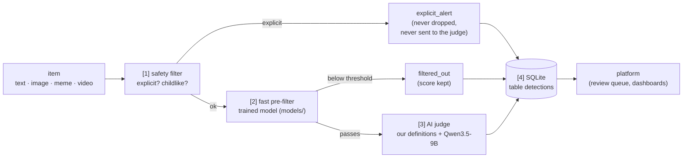

# Detection for the platform: how to use it

This is the main document for the platform team. It explains how the detection part (safety filter, fast
pre-filter, AI judge) turns one item (text, image, meme or video) into one row of the SQLite table `detections`, and
how to read that table.

- One entry point: `harmwatch/analyze.py`, as a Python function or from the command line.
- One output: the table `detections` in `data/harmwatch.db`, the same file as the rest of the platform. Set
  `HARMWATCH_DB` to use another path.
- The definitions it applies are in [`policy/README.md`](../../policy/README.md). The measured results are in
  [`docs/presentation/RESULTS_FOR_SLIDES.md`](../presentation/RESULTS_FOR_SLIDES.md).

**How rows reach reviewers.** Collected posts (Apify, Telegram, community reports) go through
`harmwatch/intake.py`: copies of the same content are grouped by fingerprints (`harmwatch/dedup.py`), `analyze()` runs
once per group, and `harmwatch/publish.py` sends groups routed for review to the SignalSafe backend, where they appear
as one queue item per group. Restricted rows are never sent. Human decisions are recorded in the backend (`reviews`).
See the [root README](../../README.md#architecture).

## 1. The pipeline



The same flow in text:

```
item ──► [1] safety filter ──► [2] fast pre-filter ──► [3] AI judge ──► [4] table `detections` ──► platform
         (images, frames)      (images, memes,          (all modalities;     (one row per item)
          explicit → alert       video frames;            video: per segment,
          childlike → minor rule  text skips it)          worst segment kept)
```

- **[1] Safety filter.** It runs on images and video frames. Explicit content (nudity, sexual acts) raises a
  priority alert. The item is recorded and never silently dropped, but it is never sent to the judge and never
  shown. A childlike appearance is a signal that only matters when combined with a sexual element: it then raises
  `possible_minor`.
- **[2] Fast pre-filter.** It runs on images, memes and video frames; text skips it. It takes about 0.03 s per
  image and gives a score between 0 and 1.
  - Below the threshold, the item is recorded as `filtered_out` with its score, and the judge is not called.
  - For a video, each segment is filtered. The video is `filtered_out` only if no segment passes.
- **[3] AI judge.** Qwen3.5-9B runs on the local server started by `scripts/serve_llm.sh`, with our definitions in
  the frozen prompt v3. The code refuses to run if that prompt has changed.
  - It returns five scores from 0 to 100, a decision `sexual`, a category, a relation to sexual violence and one
    neutral sentence.
  - Video: the video is cut into segments of 5 to 20 s. Each segment is judged from its speech (transcript), its
    on-screen text and its middle frame. The video keeps the worst segment, and its start and end in seconds are
    stored.
- **[4] Table `detections`.** Each item produces one row. Rule CH-5 applies: if a minor may be involved, the row is
  restricted and no content field is stored.

## 2. Who does what

| component | file(s) | role |
|---|---|---|
| Definitions | `policy/` (`core.md`, `children.md`, `modalities.md`, `platforms/`, `regions/`, `topics/`) | What counts as sexual violence, harassment, hate…; the rules the judge and the code apply. |
| Frozen prompts | `docs/prompts/` | The exact instructions the judge received during evaluation (v3 is used here; fingerprint checked). |
| Safety filter | `harmwatch/safety.py` | Explicit-content alert and childlike-appearance signal, before anything else. |
| Fast pre-filter | `harmwatch/prefilter.py`, `models/prefilter_image_logreg.joblib`, `models/prefilter.json` | Scores images with a small trained model; skips the judge for clearly harmless images. |
| Pre-filter training | `harmwatch/cascade.py`, `scripts/eval_cascade.py` | How the pre-filter was trained (learning from the AI judge) and evaluated. |
| AI judge, text | `harmwatch/crsv.py` | Full text assessment against `policy/core.md` (routes, priorities), used by the Telegram pipeline. |
| AI judge, images | `harmwatch/sv_scores.py`, `harmwatch/vision.py` | Scores 0-100 and `sexual` decision for images, memes and text (used by `analyze.py`). |
| Video | `harmwatch/video_segments.py` | Scenes, frames, speech-to-text, on-screen text, per-segment judgement. |
| **Single entry point** | `harmwatch/analyze.py` | `analyze(item, region)` and `python -m harmwatch.analyze`: runs steps 1-4. |
| Output table | `harmwatch/detections.py`, `docs/platform/schema.sql` | Creates and fills the table `detections` (CH-5 enforced in code and in the table). |
| Existing platform tables | `harmwatch/db.py` | `posts`, `classifications`, `assessments`, `decisions` (unchanged). |
| Model server | `scripts/serve_llm.sh` | Starts llama.cpp with Qwen3.5-9B (text + vision) on port 8080. |
| Evaluation | `scripts/eval_*.py` | Benchmarks behind every number (images, video, cascade). |
| Results | `docs/results/`, `docs/presentation/` | Tables, figures (including `figures_public/` for a non-technical audience), slides summary. |
| Tests | `tests/test_analyze_*.py` | The whole entry point with a simulated judge (no GPU). |

## 3. Quick start

**Hardware.** Tested on 1× NVIDIA V100 32 GB. The judge server uses about 15 GB of it (measured with the default settings of
`scripts/serve_llm.sh`), and the safety filter, pre-filter
and speech-to-text fit next to it. Text-only use still needs the judge server, which needs a GPU.

```bash
# 1. install (Python 3.11)
python -m venv .venv && source .venv/bin/activate
pip install -r requirements-detection.txt          # includes requirements.txt

# 2. start the AI judge (llama.cpp built as in the header of the script; Qwen3.5-9B Q8_0 GGUF + mmproj F16)
scripts/serve_llm.sh &                               # serves http://127.0.0.1:8080/v1
export LOCAL_LLM_URL=http://127.0.0.1:8080/v1        # default value, also in .env.example

# 3. analyse one item: writes a row in data/harmwatch.db and prints it
python -m harmwatch.analyze text "Community meeting about the new water well on Saturday."
python -m harmwatch.analyze image path/to/meme.jpg --url https://example.org/post/1
python -m harmwatch.analyze video path/to/video.mp4 --region global

# 4. read the table
sqlite3 data/harmwatch.db "SELECT id, modality, route, priority, sexual, summary FROM detections ORDER BY id DESC LIMIT 5"
```

**From the platform code:**

```python
from harmwatch.analyze import analyze

row = analyze({"modality": "image", "path": "/tmp/upload.jpg", "url": "https://...", "source": "extension"},
              region="global")
# row = the dict of the line written in `detections`; delete /tmp/upload.jpg afterwards (never keep raw media)
```

- Item keys:
  - `modality` (`text`, `image`, `meme` or `video`);
  - `text` for a text, or `path` for an image or video;
  - for an image, optionally `text` with its embedded text (otherwise OCR reads it, if installed);
  - optionally `url` and `source`.
- `region` must be the name of a file `policy/regions/<region>.yaml`. It selects the region's age indicators for the
  minor rule. The judge prompt itself stays the frozen v3 prompt, built with the global profile, for every region.
- Options on the command line: `--no-prefilter` sends everything to the judge, and `--db` writes to another file.

**Downloaded on first run (not in git).** These models come from Hugging Face into `~/.cache/huggingface` (sizes
measured in our cache):
- SigLIP 2 (`google/siglip2-so400m-patch14-384`, 4.3 GB), used by the pre-filter;
- CLIP ViT-L/14 (1.6 GB), Falconsai and AdamCodd (0.33 GB each), used by the safety filter;
- faster-whisper large-v3-turbo (1.6 GB), used for video.

The Qwen3.5-9B GGUF files are downloaded separately (see `scripts/serve_llm.sh`). Only the small trained pre-filter
is in git, in `models/` (33 KB of weights).

## 4. Reading the table `detections`

The full SQL is in [`schema.sql`](schema.sql). In the table, NULL means "not computed": the item was not judged, is
restricted, or the column does not apply.

| column | meaning |
|---|---|
| `id` | Row number. |
| `created_at` | When the item was analysed (UTC, ISO 8601). |
| `source` | Who sent the item: `telegram`, `volunteer`, `extension`, `cli`… (free text given by the caller). |
| `url` | Where the item was seen. The media itself is never stored. |
| `modality` | `text`, `image`, `meme` (image with embedded text) or `video`. |
| `media_hash` | sha256 of the file (or of the text): to find duplicates without keeping the media. |
| `filter_score` | Pre-filter score 0-1 (for video: the highest segment). NULL for text or with `--no-prefilter`. |
| `filter_passed` | 1 = sent to the judge, 0 = stopped by the pre-filter. |
| `sexual_violence` … `other_violence` | Five independent scores 0-100 from the judge (0 absent, 50 clearly present, 100 extreme): sexual violence, sexual harassment, hate, misogyny, other violence. |
| `sexual` | Judge decision: 1 = sexual violence or sexual harassment, as defined in `policy/core.md`. |
| `category` | Kind of content: `threat_incitement`, `rape_joke_glorification`, `denial_minimization`, `victim_stigmatisation`, `collective_accusation`, `incident`, `sexualised_insult`, `degrading_sexualisation`, `humiliating_objectification`, `none`. |
| `primary_relation` | Relation to sexual violence, `SV-REL-1` to `SV-REL-5` (`policy/core.md`), or NULL. |
| `route` | What the platform should do; see the list below. |
| `priority` | `urgent`, `high`, `standard` or `none`. |
| `flagged_start_s`, `flagged_end_s` | Video only: the flagged passage, in seconds. |
| `summary` | One neutral, non-graphic sentence from the judge. |
| `explicit_alert` | 1 = the safety filter found explicit content (the media must never be shown). |
| `possible_minor` | 1 = a minor may be involved (rule CH-5). |
| `restricted` | 1 = restricted item: no content is stored and it must never be displayed; it goes to the restricted escalation channel only. |
| `model` | What took the decision: the judge (`qwen3.5-9b`), the pre-filter (`prefilter_image_logreg`) or the safety filter. |
| `prompt_version` | Frozen prompt of the judge (`sv_prompt_v3`). |
| `region` | Region profile used for the rules. |
| `latency_ms` | Processing time of the item (the first item also includes loading the models). |
| `full_result_json` | Details: judge output, P(sexual) from the model, video segments, rule notes. It never contains the raw text or media, and it is reduced when the row is restricted. |

**Routes and priorities.** The table below is a simple triage of the judge output, done in `analyze.triage`. It is
not a policy rule, and the platform can re-rank using the scores.

| route | when | priority |
|---|---|---|
| `restricted_escalation` | `possible_minor` (from the judge, the rules or the safety signal) | `urgent` |
| `explicit_alert` | explicit content found by the safety filter | `urgent` |
| `priority_review` | `sexual` = 1 and relation `SV-REL-2` (threat or incitement) or `SV-REL-5` (victim stigmatisation) | `high` |
| `standard_review` | other items with `sexual` = 1 | `standard` |
| `not_flagged` | judged, `sexual` = 0 | `none` |
| `filtered_out` | stopped by the pre-filter (judge not called) | `none` |
| `judge_error` | the judge could not answer (server down, invalid output): a human should look | `standard` |

**Example row** (made-up values):

| id | created_at | source | url | modality | media_hash | filter_score | filter_passed | sexual_violence | sexual_harassment | hate | misogyny | other_violence | sexual | category | primary_relation | route | priority | flagged_start_s | flagged_end_s | summary | explicit_alert | possible_minor | restricted | model | prompt_version | region | latency_ms |
|---|---|---|---|---|---|---|---|---|---|---|---|---|---|---|---|---|---|---|---|---|---|---|---|---|---|---|---|
| 42 | 2026-09-27T10:15:02+00:00 | extension | https://example.org/post/123 | meme | 3f9a…c1 | 0.71 | 1 | 10 | 65 | 20 | 70 | 0 | 1 | sexualised_insult | NULL | standard_review | standard | NULL | NULL | Sexualised insult targeting women as a group (SH-1). | 0 | 0 | 0 | qwen3.5-9b | sv_prompt_v3 | global | 1480 |

**Three useful queries:**

```sql
-- 1. Review queue: what a reviewer should see first (restricted rows are handled apart, never listed here)
SELECT id, created_at, modality, route, priority, sexual_violence, sexual_harassment, summary, url
FROM detections
WHERE restricted = 0 AND route IN ('explicit_alert', 'priority_review', 'standard_review', 'judge_error')
ORDER BY CASE priority WHEN 'urgent' THEN 0 WHEN 'high' THEN 1 WHEN 'standard' THEN 2 ELSE 3 END, created_at;

-- 2. Items judged sexual today, strongest first
SELECT id, created_at, modality, category, sexual_violence, sexual_harassment, summary, url
FROM detections
WHERE sexual = 1 AND date(created_at) = date('now')
ORDER BY max(sexual_violence, sexual_harassment) DESC;

-- 3. Restricted alerts to count (per day), without ever reading their content
SELECT date(created_at) AS day, count(*) AS restricted_alerts
FROM detections
WHERE restricted = 1
GROUP BY day ORDER BY day DESC;
```

## 5. Measured performance and limits

All numbers come from [`docs/presentation/RESULTS_FOR_SLIDES.md`](../presentation/RESULTS_FOR_SLIDES.md) and
[`docs/results/ALL_METRICS.csv`](../results/ALL_METRICS.csv). The same numbers in plain language are in
[`docs/presentation/figures_public/INDEX.md`](../presentation/figures_public/INDEX.md).

- **Images (120 hand-checked memes).** The four models are tied (accuracy score F1 0.898 to 0.918). Qwen3.5-9B scores
  F1 0.912 with the frozen first version of the prompt. The improved version (v3, used here) scores 0.933, but that
  number is indicative only, because v3 was tuned on these memes.
- **Fast pre-filter** (numbers in `models/prefilter.json`):
  - on the 120 memes, it catches 58 of the 60 harmful ones (recall 0.967, 95 % CI 0.886-0.991);
  - in a simulated feed with 10 % harmful content, it sends 47.8 % of items to the judge, which makes the system
    about 2× faster (0.75 s instead of 1.51 s per image).
- **Video.** The test was on racism (15 racist, 15 not), because there is no open video dataset on sexual violence.
  The system found all 15 racist videos with 1 false alarm. It needs about 12.8 s of computing per minute of video
  (a 10-minute video takes about 2 minutes; this is an estimate).

**Limits:**
- **Test sets are small.** The results come from 120 memes and 30 videos.
- **v3 prompt.** It was tuned on the image test set, so its score there is indicative.
- **Judge for sexual content on video: not evaluated.** The video test used racism, with its own topic prompt. Here,
  the v3 judge is applied to each segment using its speech, on-screen text and middle frame.
- **Text posts.** They are judged by the same v3 judge in text-only mode. This mode was evaluated only on the text
  written on memes (F1 0.876 with v3, indicative). The fuller text assessor `harmwatch/crsv.py` remains available.
- **The pre-filter is a research experiment**, trained on image-derived features (rule B5). It must be validated by
  the team before operational use.
  - It was trained on memes and only sees the image: content carried by speech or text alone can be filtered out.
  - In the racism test, most racist content was in the speech. For video, consider `--no-prefilter`.
- **The safety filter has false positives** on non-photographic images. In a smoke test, the colour bars of a
  synthetic test video were flagged as explicit by the CLIP classifier (score 0.97, threshold 0.9). Its thresholds
  are still to be decided (`TODO_SECURITE.md`).
- **Region.** It changes the deterministic minor rule, not the judge prompt.

## 6. Safety rules for the platform

1. **Media blurred by default.** A reviewer must click to see a media item. Never show a media item with
   `explicit_alert = 1` (no preview, no thumbnail).
2. **Never display restricted items.** Rows with `restricted = 1` hold no content by design. They go only to the
   restricted escalation channel (policy `children.md`, CH-5). They are never shown in lists, never exported, and
   never used for training.
3. **Never store the raw media.** Delete the uploaded file after `analyze()`. Keep only the `url` and the
   `media_hash`; the table was designed for this.
4. **The judge proposes, a human decides.** Scores and routes prioritise review; they are not a verdict. The platform
   records the human decisions (backend table `reviews`).
5. **Keep `.env`, `data/` and `results/` out of git** (already in `.gitignore`).
